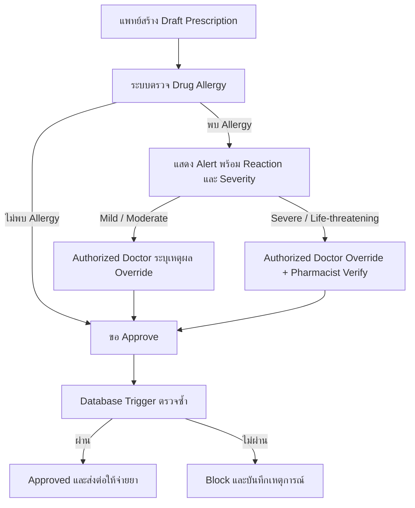

# ข้อ 4: Drug Allergy & Safety Design

## แนวคิดของผม

ผมแยกใบสั่งยาเป็น `prescriptions` และ `prescription_items` เพราะหนึ่งใบสั่งยามียาได้หลายตัว ส่วนประวัติแพ้ยาเก็บใน `drug_allergies` โดยผูกผู้ป่วยกับยาที่แพ้โดยตรง

ผมให้แพทย์บันทึกเป็น `draft` ได้ เพื่อให้ระบบแสดงรายละเอียดและคำเตือนก่อน แต่ draft ยังนำไปจ่ายยาไม่ได้ ตอนเปลี่ยนสถานะเป็น `approved` database trigger จะตรวจ allergy ซ้ำเป็นด่านสุดท้าย ถ้ายังไม่มี override ที่ถูกต้อง database จะไม่ยอม approve

เหตุผลที่ใช้ trigger เพราะ `CHECK constraint` ปกติตรวจข้อมูลข้าม `prescriptions`, `prescription_items` และ `drug_allergies` ไม่ได้ ส่วน foreign key กับ unique constraint ยังใช้ป้องกัน reference ผิดและข้อมูลซ้ำตามปกติ

## สิทธิ์ในการ override

- Mild/Moderate: แพทย์ที่ได้รับสิทธิ์ `can_override_allergy` override ได้ แต่ต้องระบุเหตุผลอย่างน้อย 10 ตัวอักษร
- Severe/Life-threatening: ต้องมีทั้งแพทย์ที่ได้รับสิทธิ์ override และเภสัชกรที่ได้รับสิทธิ์ verify
- Nurse, admin, แพทย์ที่ไม่ได้รับสิทธิ์ และเภสัชกรที่ไม่ได้รับสิทธิ์ verify ไม่สามารถผ่าน workflow นี้ได้
- ทุก override เก็บผู้ทำรายการ เหตุผล ผู้ตรวจสอบ และเวลาไว้ใน `allergy_overrides`

## Workflow



## Database schema และ constraints

โค้ดด้านล่างตรงกับไฟล์ [`04-drug-allergy-schema.sql`](04-drug-allergy-schema.sql) ทั้งหมด

```sql
CREATE TABLE patients (
  id BIGINT PRIMARY KEY,
  name TEXT NOT NULL
);

CREATE TABLE staff (
  id BIGINT PRIMARY KEY,
  name TEXT NOT NULL,
  role TEXT NOT NULL CHECK (role IN ('doctor', 'pharmacist', 'nurse', 'admin')),
  can_override_allergy BOOLEAN NOT NULL DEFAULT FALSE,
  can_verify_allergy_override BOOLEAN NOT NULL DEFAULT FALSE
);

CREATE TABLE drugs (
  id BIGINT PRIMARY KEY,
  generic_name TEXT NOT NULL UNIQUE
);

CREATE TABLE drug_allergies (
  id BIGINT GENERATED ALWAYS AS IDENTITY PRIMARY KEY,
  patient_id BIGINT NOT NULL REFERENCES patients (id),
  drug_id BIGINT NOT NULL REFERENCES drugs (id),
  reaction TEXT,
  severity TEXT NOT NULL CHECK (
    severity IN ('mild', 'moderate', 'severe', 'life_threatening')
  ),
  is_active BOOLEAN NOT NULL DEFAULT TRUE,
  recorded_at TIMESTAMPTZ NOT NULL DEFAULT NOW(),
  UNIQUE (patient_id, drug_id)
);

CREATE TABLE prescriptions (
  id BIGINT GENERATED ALWAYS AS IDENTITY PRIMARY KEY,
  patient_id BIGINT NOT NULL REFERENCES patients (id),
  prescribed_by BIGINT NOT NULL REFERENCES staff (id),
  status TEXT NOT NULL DEFAULT 'draft' CHECK (
    status IN ('draft', 'pending_review', 'approved', 'cancelled')
  ),
  created_at TIMESTAMPTZ NOT NULL DEFAULT NOW(),
  approved_at TIMESTAMPTZ
);

CREATE TABLE prescription_items (
  id BIGINT GENERATED ALWAYS AS IDENTITY PRIMARY KEY,
  prescription_id BIGINT NOT NULL REFERENCES prescriptions (id) ON DELETE CASCADE,
  drug_id BIGINT NOT NULL REFERENCES drugs (id),
  dosage TEXT NOT NULL,
  frequency TEXT NOT NULL,
  UNIQUE (prescription_id, drug_id)
);

CREATE TABLE allergy_overrides (
  id BIGINT GENERATED ALWAYS AS IDENTITY PRIMARY KEY,
  prescription_item_id BIGINT NOT NULL UNIQUE
    REFERENCES prescription_items (id) ON DELETE RESTRICT,
  overridden_by BIGINT NOT NULL REFERENCES staff (id),
  verified_by BIGINT REFERENCES staff (id),
  reason TEXT NOT NULL CHECK (CHAR_LENGTH(TRIM(reason)) >= 10),
  created_at TIMESTAMPTZ NOT NULL DEFAULT NOW()
);

CREATE OR REPLACE FUNCTION enforce_allergy_override_roles()
RETURNS TRIGGER
LANGUAGE plpgsql
AS $$
DECLARE
  override_role TEXT;
  override_allowed BOOLEAN;
  verifier_role TEXT;
  verifier_allowed BOOLEAN;
BEGIN
  SELECT role, can_override_allergy
  INTO override_role, override_allowed
  FROM staff
  WHERE id = NEW.overridden_by;

  IF override_role IS DISTINCT FROM 'doctor'
    OR NOT COALESCE(override_allowed, FALSE)
  THEN
    RAISE EXCEPTION 'Only an authorized doctor can override an allergy alert';
  END IF;

  IF NEW.verified_by IS NOT NULL THEN
    SELECT role, can_verify_allergy_override
    INTO verifier_role, verifier_allowed
    FROM staff
    WHERE id = NEW.verified_by;

    IF verifier_role IS DISTINCT FROM 'pharmacist'
      OR NOT COALESCE(verifier_allowed, FALSE)
    THEN
      RAISE EXCEPTION 'Verifier must be an authorized pharmacist';
    END IF;
  END IF;

  RETURN NEW;
END;
$$;

CREATE TRIGGER trg_enforce_allergy_override_roles
BEFORE INSERT OR UPDATE ON allergy_overrides
FOR EACH ROW
EXECUTE FUNCTION enforce_allergy_override_roles();

CREATE OR REPLACE FUNCTION validate_prescription_allergies()
RETURNS TRIGGER
LANGUAGE plpgsql
AS $$
BEGIN
  IF NEW.status <> 'approved' THEN
    RETURN NEW;
  END IF;

  IF NOT EXISTS (
    SELECT 1
    FROM prescription_items
    WHERE prescription_id = NEW.id
  ) THEN
    RAISE EXCEPTION 'Cannot approve a prescription without items';
  END IF;

  IF EXISTS (
    SELECT 1
    FROM prescription_items AS pi
    JOIN drug_allergies AS da
      ON da.patient_id = NEW.patient_id
     AND da.drug_id = pi.drug_id
     AND da.is_active = TRUE
    LEFT JOIN allergy_overrides AS ao
      ON ao.prescription_item_id = pi.id
    WHERE pi.prescription_id = NEW.id
      AND ao.id IS NULL
  ) THEN
    RAISE EXCEPTION 'ALLERGY_BLOCK: an allergy override is required';
  END IF;

  IF EXISTS (
    SELECT 1
    FROM prescription_items AS pi
    JOIN drug_allergies AS da
      ON da.patient_id = NEW.patient_id
     AND da.drug_id = pi.drug_id
     AND da.is_active = TRUE
    JOIN allergy_overrides AS ao
      ON ao.prescription_item_id = pi.id
    WHERE pi.prescription_id = NEW.id
      AND da.severity IN ('severe', 'life_threatening')
      AND ao.verified_by IS NULL
  ) THEN
    RAISE EXCEPTION
      'ALLERGY_BLOCK: severe allergies require pharmacist verification';
  END IF;

  NEW.approved_at = NOW();
  RETURN NEW;
END;
$$;

CREATE TRIGGER trg_validate_prescription_allergies
BEFORE INSERT OR UPDATE ON prescriptions
FOR EACH ROW
EXECUTE FUNCTION validate_prescription_allergies();

CREATE INDEX idx_drug_allergies_active_patient_drug
  ON drug_allergies (patient_id, drug_id)
  WHERE is_active = TRUE;

CREATE INDEX idx_prescription_items_prescription_drug
  ON prescription_items (prescription_id, drug_id);
```

## การแจ้งเตือนฝั่งระบบ

ฝั่ง application ควรตรวจทันทีเมื่อแพทย์เพิ่มยาใน draft แล้วแสดงชื่อยา reaction และ severity ให้เห็นชัด แต่ไม่ควรเชื่อแค่ frontend เพราะ request อาจข้าม UI ได้ ดังนั้น database trigger จะตรวจซ้ำตอน approve เสมอ

ตัวอย่างนี้จับ allergy ด้วย `drug_id` ตรงกันก่อน ถ้าเป็นระบบจริงผมจะเพิ่ม active ingredient และ drug class เพื่อจับยาคนละยี่ห้อที่มีตัวยาเดียวกันด้วย

ชุดทดสอบ PostgreSQL อยู่ใน [`04-drug-allergy.test.sql`](04-drug-allergy.test.sql) ครอบคลุม safe prescription, allergy ที่ไม่มี override, mild override, severe allergy ที่ต้องมี pharmacist verification และผู้ใช้ที่ไม่มีสิทธิ์ override
