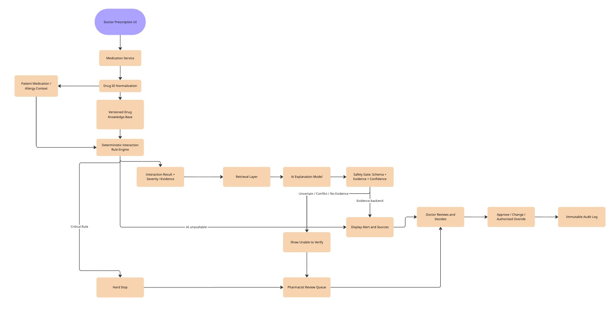

# ข้อ 7: Smart Drug Interaction Checker

## แนวคิดของผม

ผมไม่ให้ AI เป็นแหล่งตัดสินว่าใช้ยาร่วมกันได้หรือไม่โดยตรง ฐานข้อมูลยาแบบมี version และ deterministic rule engine จะเป็น safety source หลัก ส่วน AI มีหน้าที่นำหลักฐานที่ระบบค้นได้มาอธิบายให้แพทย์อ่านง่ายและสัมพันธ์กับบริบทของผู้ป่วย

AI ไม่ได้เชื่อม database ด้วย credential โดยตรง แต่รับเฉพาะ interaction records และ evidence ที่ Retrieval Layer เลือกมาแล้ว วิธีนี้จำกัดข้อมูลที่ model เห็นและทำให้ตรวจสอบที่มาของคำตอบได้

## Architecture

Diagram ด้านล่างตรงกับไฟล์ [`07-drug-interaction.mmd`](07-drug-interaction.mmd) ทั้งหมด

> คลิกที่ภาพเพื่อเปิด Flowchart บน Miro

```mermaid
flowchart LR
    A["Doctor Prescription UI"] --> B["Medication Service"]
    B --> C["Drug ID Normalization"]
    C --> D["Versioned Drug Knowledge Base"]
    C --> E["Patient Medication / Allergy Context"]
    D --> F["Deterministic Interaction Rule Engine"]
    E --> F

    F --> G["Interaction Result + Severity + Evidence"]
    G --> H["Retrieval Layer"]
    H --> I["AI Explanation Model"]
    I --> J["Safety Gate: Schema + Evidence + Confidence"]

    J -->|"Evidence-backed"| K["Display Alert and Sources"]
    J -->|"Uncertain / Conflict / No Evidence"| L["Show Unable to Verify"]
    L --> M["Pharmacist Review Queue"]
    K --> N["Doctor Reviews and Decides"]
    M --> N

    F -->|"Critical Rule"| O["Hard Stop"]
    O --> M
    F -->|"AI unavailable"| K

    N --> P["Approve / Change / Authorized Override"]
    P --> Q["Immutable Audit Log"]
```

## การทำงาน

1. Medication Service รับรายการยาที่แพทย์กำลังสั่งและ normalize เป็นรหัสยามาตรฐานก่อน เพื่อไม่ให้ชื่อการค้าหรือการสะกดต่างกันทำให้ตรวจไม่เจอ
2. Rule Engine ตรวจคู่ยาเทียบกับ versioned drug knowledge base และบริบทที่จำเป็น เช่น ยาที่ใช้อยู่และประวัติแพ้ยา
3. ผลลัพธ์ต้องมี severity, mechanism, evidence source, source version และเวลาที่อัปเดต
4. Retrieval Layer ส่งเฉพาะหลักฐานที่เกี่ยวข้องให้ AI สรุป ห้ามให้ model สร้าง interaction จากความจำอย่างเดียว
5. Safety Gate ตรวจ output schema, citation, evidence coverage และ uncertainty ก่อนแสดงผล
6. แพทย์เป็นผู้ตัดสินสุดท้าย และทุกการ approve, เปลี่ยนยา หรือ override ถูกเก็บใน audit log

## Safety First เมื่อ AI ไม่มั่นใจ

ถ้า AI ตอบว่าไม่มั่นใจ ระบบจะไม่แปลงความหมายเป็น “ไม่พบปฏิกิริยาระหว่างยา” เพราะสองข้อความนี้ไม่เหมือนกัน ผมออกแบบสถานะให้แยกอย่างชัดเจน:

- `interaction_found`: พบ interaction พร้อมหลักฐาน
- `no_known_interaction`: ไม่พบในฐานข้อมูล version ที่ใช้อยู่ แต่ไม่ได้รับรองว่าปลอดภัยแน่นอน
- `uncertain`: หลักฐานไม่พอ ขัดแย้ง หรือข้อมูลผู้ป่วยไม่ครบ
- `system_unavailable`: model หรือ dependency ใช้งานไม่ได้

เมื่อเป็น `uncertain`:

1. แสดงข้อความ “ระบบไม่สามารถยืนยันความปลอดภัยได้” แทนการให้คำแนะนำเชิงบวก
2. แสดงผลจาก rule engine, แหล่งอ้างอิง, version และข้อมูลที่ยังขาดให้แพทย์เห็น
3. ส่งรายการไปยัง pharmacist review queue
4. ถ้า rule engine ระบุความเสี่ยงระดับ critical ให้ hard stop จนกว่าเภสัชกรตรวจและผู้มีสิทธิ์ดำเนินการตาม policy
5. AI ไม่มีสิทธิ์ approve, เปลี่ยนยา หรือเขียนกลับ prescription โดยตรง
6. เก็บ input, retrieved evidence, model version, output และการตัดสินใจของมนุษย์ใน audit log

## Human-in-the-loop

- แพทย์ต้องเห็นเหตุผลและหลักฐานเพื่อประเมินได้เอง ไม่แสดงเพียงคะแนน confidence
- เภสัชกรเข้ามาตรวจกรณี critical, uncertain, evidence conflict หรือข้อมูลผู้ป่วยไม่ครบ
- การ override ต้องจำกัดสิทธิ์ บังคับระบุเหตุผล และเก็บชื่อผู้ดำเนินการกับเวลา
- ถ้า AI ใช้งานไม่ได้ ระบบยังแสดง deterministic rule result ได้ ไม่ควรหยุด safety check ทั้งระบบ
- ใช้ผลการ review เป็นข้อมูล monitor คุณภาพ แต่ไม่ให้ระบบเรียนรู้หรือเปลี่ยน rule อัตโนมัติโดยไม่มี clinical governance

## Data protection และ monitoring

- ส่งให้ model เฉพาะข้อมูลที่จำเป็น เช่น รหัสยา อายุช่วง และค่าทางคลินิกที่มีผลต่อ interaction โดยตัด identifier ที่ไม่จำเป็น
- ใช้ private deployment หรือผู้ให้บริการที่มีข้อตกลงจัดการข้อมูลสุขภาพตาม policy ของโรงพยาบาล
- Monitor false negative, false positive, override rate, uncertain rate และเหตุการณ์ที่เภสัชกรแก้คำแนะนำของระบบ
- เมื่อฐานข้อมูลยาเปลี่ยน version ต้อง regression test interaction สำคัญก่อนเปิดใช้งาน

## References

- [FDA Clinical Decision Support](https://www.fda.gov/medical-devices/digital-health-center-excellence/step-6-software-function-intended-provide-clinical-decision-support) — ผู้เชี่ยวชาญควรตรวจสอบที่มาของคำแนะนำได้และใช้วิจารณญาณของตนเอง
- [NIST AI Risk Management Framework](https://www.nist.gov/publications/artificial-intelligence-risk-management-framework-ai-rmf-10) — แนวทางจัดการความเสี่ยงและกำกับดูแล AI ตลอดวงจรชีวิต
