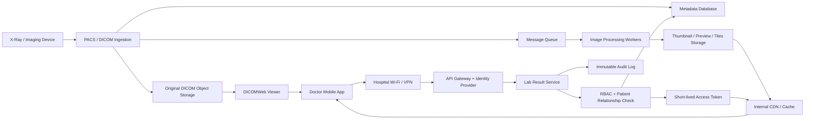

# ข้อ 5: System Scalability — Lab Results

## ภาพรวมที่ผมออกแบบ

ผมแยกข้อมูลออกเป็นสองส่วน ภาพ X-Ray ต้นฉบับเก็บใน PACS/VNA หรือ S3-compatible Object Storage ส่วน relational database เก็บเฉพาะ metadata เช่น patient ID, study ID, object key, checksum และสถานะผลตรวจ ไม่ควรเก็บไฟล์ภาพขนาดใหญ่เป็น BLOB ใน database หลัก

ภาพต้นฉบับใช้ DICOM และเก็บแบบไม่ลดคุณภาพเพื่อเป็น source of truth ส่วน mobile จะโหลด thumbnail, preview หรือ image tiles ที่สร้างไว้ล่วงหน้า ถ้าแพทย์ต้องใช้ภาพเพื่อวินิจฉัย ระบบจึงค่อยเปิด diagnostic-quality image จากต้นฉบับ

## Architecture

## Storage Strategy

### 1. Original image

- เก็บ DICOM ต้นฉบับใน PACS/VNA หรือ Object Storage ที่รองรับ replication, versioning และ checksum
- แยก bucket/container ของ original ออกจาก derived images
- ใช้ object key แบบสุ่ม ไม่ใส่ชื่อหรือเลขผู้ป่วยใน URL
- เข้ารหัสข้อมูลขณะเก็บด้วย KMS และสำรองข้อมูลแยก failure domain
- ใช้ lifecycle policy ย้ายผลตรวจเก่าไป warm/cold storage ตาม retention policy โดยยังเรียกคืนได้

### 2. Metadata

- Database เก็บ `patient_id`, `study_id`, `modality`, `captured_at`, `object_key`, `checksum` และสถานะผลตรวจ
- ทำ index ที่ `patient_id`, `study_id` และ `captured_at` เพื่อค้นประวัติได้เร็ว
- ไฟล์ภาพไม่ผ่าน API server โดยตรง เพื่อลด memory และ network load ที่ application layer

### 3. Derived image

- Worker สร้าง thumbnail, mobile preview และ image tiles แบบ asynchronous หลังรับภาพ
- Thumbnail ใช้ compression ได้เพื่อให้เปิดรายการเร็ว
- ภาพสำหรับวินิจฉัยต้องรักษาคุณภาพตาม clinical requirement และไม่เขียนทับ DICOM ต้นฉบับ
- Derived image ต้องมี reference กลับไปยัง source และระบุชัดว่าเป็น preview หรือ diagnostic quality

## ทำให้เปิดภาพบน Mobile ได้ลื่น

1. หน้า list โหลดเฉพาะ metadata และ thumbnail
2. เมื่อเปิดผลตรวจ ให้โหลด preview หรือ tiles ตามตำแหน่งที่แพทย์กำลังดู
3. ใช้ HTTP range request หรือ DICOMWeb สำหรับการดึงข้อมูลบางส่วน แทนการรอโหลดไฟล์เต็ม
4. Internal CDN cache เฉพาะ derived image ใกล้จุดใช้งานภายในโรงพยาบาล
5. ใช้ short-lived signed token และ cache key ที่แยกตามสิทธิ์ ไม่เปิด object storage เป็น public
6. Mobile prefetch ภาพถัดไปเมื่อเครือข่ายว่าง และ retry แบบ exponential backoff เมื่อสัญญาณไม่เสถียร
7. Original storage, workers และ API scale แยกกันได้ โดย queue ช่วยรับช่วงเวลาที่มีภาพเข้ามาจำนวนมาก

## Data Privacy และ PDPA

ผมมองภาพ X-Ray และผลตรวจเป็นข้อมูลสุขภาพที่ต้องควบคุมทั้งคนที่เข้าถึง วัตถุประสงค์ และระยะเวลาจัดเก็บ ไม่ใช่แค่ซ่อน URL

### Access control

- ใช้ MFA และบัญชีบุคลากรรายบุคคล ห้ามใช้ shared account
- ใช้ RBAC ร่วมกับ ABAC เช่น ต้องเป็นแพทย์ที่ดูแลผู้ป่วย อยู่ใน encounter เดียวกัน หรือมี break-glass reason
- ตรวจสิทธิ์ที่ backend ทุกครั้งก่อนออก token ห้ามเชื่อ role ที่ส่งมาจาก mobile
- Token และ signed URL มีอายุสั้น ผูกกับ study, user และสิทธิ์ที่ขอ

### Data protection

- ใช้ TLS ทุกเส้นทาง และ mTLS ระหว่าง internal services ที่สำคัญ
- Encrypt at rest ทั้ง object storage, database, backup และ mobile cache
- ไม่ใส่ชื่อ, HN หรือข้อมูลสุขภาพใน URL, object key, analytics และ application logs
- Mobile cache ต้องเข้ารหัส มี TTL ลบเมื่อ logout และไม่ backup ขึ้น personal cloud
- จำกัดการ share/download และใช้ MDM, remote wipe หรือ watermark ตามความเสี่ยงของอุปกรณ์

### Monitoring และ governance

- เก็บ audit log ว่าใครดูผลของผู้ป่วยคนไหน เมื่อไร จากอุปกรณ์ใด และด้วยเหตุผลอะไร
- แจ้งเตือนการเข้าถึงผิดปกติ เช่น เปิดผลผู้ป่วยจำนวนมากหรือผู้ป่วยที่ไม่ได้อยู่ในความดูแล
- กำหนด retention และ deletion policy ตามวัตถุประสงค์การรักษาและข้อกำหนดทางกฎหมาย
- ผู้ให้บริการ storage/CDN ต้องมีข้อตกลงประมวลผลข้อมูลและไม่ส่งข้อมูลออกนอกขอบเขตที่อนุญาต
- เตรียม incident response สำหรับ revoke token, ปิด account, ตรวจ audit trail และแจ้งเหตุเมื่อเกิดข้อมูลรั่วไหล

## Failure handling

- ถ้า preview processing ล้มเหลว แพทย์ยังเปิดต้นฉบับผ่าน DICOMWeb ได้ตามสิทธิ์
- ถ้า CDN มีปัญหา ให้ fallback ไปยัง origin ภายใน แต่ยังต้องผ่าน authorization
- ใช้ checksum ตรวจไฟล์เสีย และมี replicated storage กับ restore test
- ห้ามแสดงผลของผู้ป่วยผิดคนเมื่อ metadata หรือ authorization service ไม่พร้อม ระบบต้อง fail closed

## References

- [DICOM Standard](https://www.dicomstandard.org/) — มาตรฐานสำหรับจัดเก็บ ส่ง เรียกดู และแสดงผล medical imaging
- [PDPC Privacy Policy](https://gppc.pdpc.or.th/privacy-policy/) — แนวทางเรื่องมาตรการรักษาความมั่นคงปลอดภัย การส่งต่อข้อมูล และระยะเวลาจัดเก็บ
